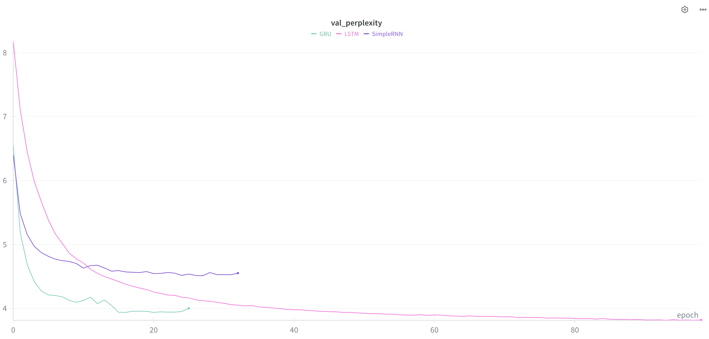
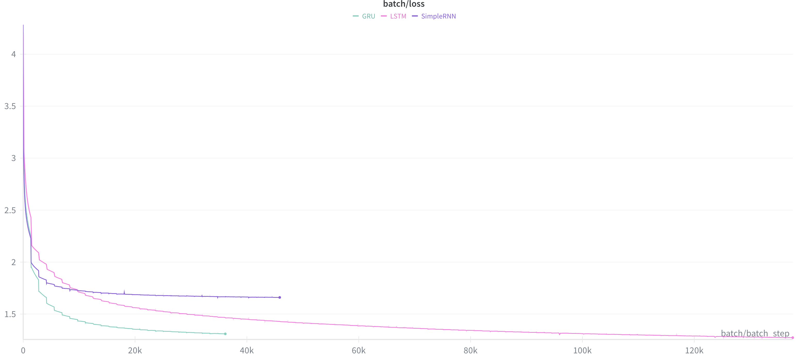

# Generación de Texto Caracter a Caracter (Char-Level RNN)

Este proyecto implementa y compara diferentes arquitecturas de Redes Neuronales Recurrentes (SimpleRNN, GRU y LSTM) para la generación de texto a nivel de caracteres. El modelo fue entrenado utilizando el corpus del libro *"La vuelta al mundo en 80 días"* de Julio Verne.

El objetivo es predecir el siguiente caracter dada una secuencia de texto anterior, permitiendo generar "nuevo" texto que imita el estilo y estructura del autor.

## Estructura del Proyecto

* **`preparar_datos.py`**: Descarga el libro, limpia el texto, genera el vocabulario y guarda los datos procesados (`corpus_tokenizado.npy` y `vocab.pkl`).
* **`train.py`**: Script de entrenamiento. Define la arquitectura, conecta con Weights & Biases (W&B) y guarda el mejor modelo (`best_model.keras`).
* **`inference_utils.py` / `generate.py`**: Funciones para cargar el modelo y generar texto usando estrategias como Greedy Search y Beam Search.
* **`vocab.pkl`**: Diccionarios de mapeo (caracter <-> índice).
* **`best_model.keras`**: El modelo entrenado con menor perplejidad.

## Instrucciones de Ejecución

### 1. Preparación del Entorno
Instala las dependencias necesarias:
```bash
pip install tensorflow numpy pandas scipy wandb python-dotenv beautifulsoup4 lxml
```

### 2. Procesamiento de Datos
Antes de entrenar, debes descargar y tokenizar el dataset. Esto genera los archivos estáticos para no repetir el proceso en cada entrenamiento.

```bash
python preparar_datos.py
```

### 3. Entrenamiento
Puedes entrenar el modelo ejecutando el script principal. El script soporta variables de entorno para cambiar la configuración sin tocar el código.

**Entrenamiento básico (SimpleRNN por defecto):**
```bash
python train.py
```

**Entrenamiento personalizado (Recomendado):**
Puedes elegir la arquitectura (`LSTM`, `GRU`, `SimpleRNN`) y el número de capas (`LAYERS`).

```bash
# Ejemplo: Entrenar una LSTM de 1 capa (Linux/Mac)
MODEL=LSTM LAYERS=1 python train.py

# Ejemplo: Entrenar una GRU (Windows PowerShell)
$env:MODEL="GRU"; python train.py
```

*Nota: Se requiere una cuenta de [Weights & Biases](https://wandb.ai/). La primera vez que lo ejecutes te pedirá tu API Key, o puedes definirla en un archivo `.env` como `WANDB_API_KEY`.*

## 📊 Análisis de Resultados

Se entrenaron tres arquitecturas bajo las mismas condiciones (Contexto: 100 caracteres, Hidden Units: 200, Optimizador: RMSprop) para comparar su desempeño. A continuación se presentan las métricas obtenidas.

### Comparativa de Perplejidad (Validation Perplexity)

La perplejidad mide qué tan "sorprendido" está el modelo al ver nuevos datos. **Menor es mejor.**



* **LSTM (Línea Rosa):** Fue el modelo más robusto. Aunque su convergencia inicial fue más lenta que la GRU, logró mantener el descenso de la métrica por más tiempo, alcanzando la **menor perplejidad final (< 3.9)** tras ~100 épocas. Esto indica una mejor capacidad para modelar dependencias a largo plazo y estructura gramatical.
* **GRU (Línea Verde):** Mostró la convergencia más rápida. En las primeras 10 épocas redujo drásticamente el error. Sin embargo, el *Early Stopping* detuvo el entrenamiento alrededor de la época 25 con una perplejidad cercana a 4.0, sugiriendo que saturó su capacidad de aprendizaje más rápido que la LSTM.
* **SimpleRNN (Línea Violeta):** Tuvo el peor desempeño. Se estancó rápidamente en una perplejidad de ~4.5. Su incapacidad para retener información de contexto le impidió aprender estructuras complejas, resultando en textos repetitivos.

### Comparativa de Loss (Batch Loss)



La gráfica de Loss confirma lo observado en la perplejidad. La **LSTM** demuestra una capacidad de aprendizaje continuo y estable a lo largo de muchos pasos de entrenamiento, mientras que la **SimpleRNN** choca con una "pared" de aprendizaje muy temprano debido al problema del desvanecimiento del gradiente.

## Modelos Pre-entrenados

El proyecto incluye tres checkpoints correspondientes a las mejores épocas de entrenamiento de cada arquitectura. Asegúrate de tener los archivos `.keras` en la raíz del proyecto:

* `simplernn_best_model.keras`: Modelo base con SimpleRNN.
* `gru_best_model.keras`: Modelo intermedio con celdas GRU.
* `lstm_best_model.keras`: Modelo con mejor rendimiento (LSTM).

##  Exploración Interactiva

Para facilitar la experimentación y comparación visual entre modelos, se incluye el notebook **`index.ipynb`** [](https://colab.research.google.com/github/joseluisdiaz/procesamiento_lenguaje_natural-tp/blob/main/Desafio_3/index.ipynb).

Este notebook ya contiene las celdas necesarias para:

1. Cargar las librerías y diccionarios.
2.  Instanciar los tres modelos entrenados.
3.  Ejecutar pruebas de generación de texto comparando estrategias (Greedy vs Beam Search) y temperaturas en tiempo real.
